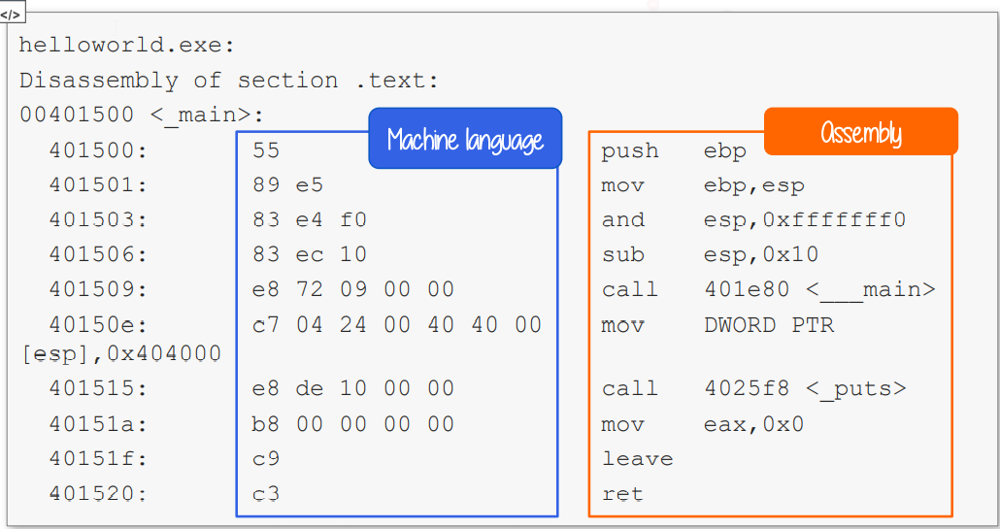

# Architecture Fundamentals

1. CPU 

* The Central Process Unit \(CPU\) is the device in charge of executing the machine code of a program.
* Each instruction is a primitive command that executes a specific operation such as move data, changes the execution flow of the program, perform arithmetic or logic operations and others
* CPU instructions are represented in hexadecimal \(HEX\) format. Due to its complexity, it is impossible for humans to utilize it in its natural format. Therefore, the same machine code gets translated into mnemonic code \(a more readable language\); this is called the assembly language \(ASM\). The two most popular are NASM \(Netwide Assembler\) and MASM\(Microsoft Macro Assembler\).

The Machine and Assembly Language

2. ISA \(Instruction set architecture\)

The ISA is the set of instructions that a programmer \(or a compiler\) must understand and use to write a program correctly for that specific CPU and machine. It includes memory, registers, instructions, etc.

One of the most common ISA is the x86 instruction set \(or architecture\) originated from the Intel 8086. The x86 acronym identifies 32-bit processors, while x64 \(aka x86\_64 or AMD64\) identifies the 64-bit versions.

3. Registers

Each CPU has its fixed set of registers that are accessed when required. You can think of registers as temporary variables used by the CPU to get and store data.

* General Purpose registers \(x86 architecture\)

The 16-bit naming convention combines the L and the H, and replaces it with an X. While for Stack Pointer, Base Pointer, Source and Destination registers it simply removes the L.

In the 32-bit representation, the register acronym is prefixed with an E, meaning extended. Whereas, in the 64-bit representation, the E is replaced with the R.

Naming conventions for every bit

EIP

The Instruction Pointer \(EIP\) controls the program execution by storing a pointer to the address of the next instruction \(machine code\) that will be executed.

Process Memory

The process is divided into four regions: Text, Data, the Heap, and the Stack.

* The Text region, or instruction segment, is fixed by the program and contains the program code \(instructions\). This region is marked as read-only since the program should not change during execution.
* The Data region is divided into initialized data and uninitialized data. Initialized data includes items such as static and global declared variables that are pre-defined and can be modified. The uninitialized data, named Block Started by Symbol \(BSS\), also initializes variables that are initialized to zero or do not have explicit initialization \(ex. static int t\).
* During the execution, the program can request more space in memory via brk and sbrk system calls, used by mlloc, realloc and free. Hence, the size of the data region can be extended.
* The Last is Stack which we will discuss in the next page.

